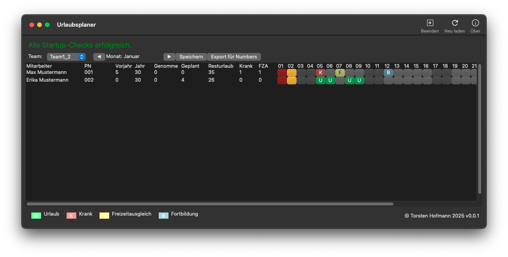

# Urlaubsplaner

  
  

Übersicht über die Jahresplanung vom Urlaub in einem Team. Gleichzeitig können auch andere Ereignisse wie Krank, Freizeitausgleich etc verwaltet werden.

  

Geschrieben in Python.

